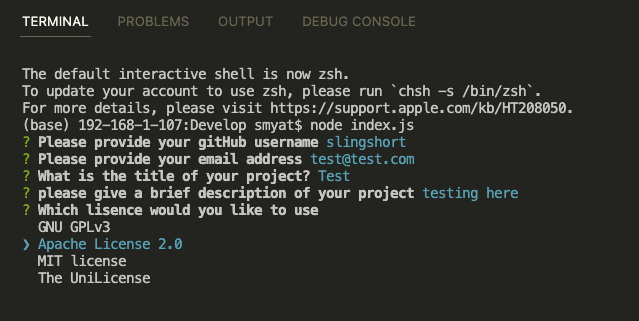
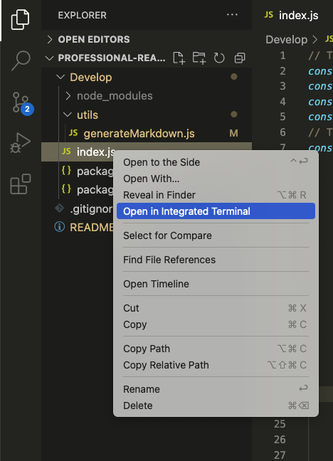

# Professional README generator

 ## Table of Contents
  - [Project Description](#description)
  - [Installation information](#Installation)  
  - [Demo](#Demo)
  - [Credits](#Credits)
  - [Extra Info](#Info)

  ## Description
  This project is a node js application that allows users to generate a professional README document via command line prompts. README files are essential for developers to communicate information about their projects to users, therefore this application is useful in providing developers with a more streamlined proccess for README file generation. <br>

  The application can be run running the command <br>
  ```node index.js```

  ## Installation
  Npm dependencies and inquirer will have to be installed. This can be by running the following commands in the terminal <br>
    ```npm i inquirer@8.2.4``` <br>
    
## Demo
Here are some photos of the program:





A video demonstration can be found here: [Video Demo](./Assets/demo%20vid/README-generator-demo.webm)

## Credits
These are the sites I used to create a lisence badge and read more information about lisences. I also found a public GitHub repo later in my development which already included markdowns of lisence badges:
- https://shields.io/category/license
- https://choosealicense.com/licenses/
- https://gist.github.com/lukas-h/2a5d00690736b4c3a7ba
Professional README guide:
- https://coding-boot-camp.github.io/full-stack/github/professional-readme-guide
NPM enquirer docs
- https://www.npmjs.com/package/inquirer#prompt

MDN web docs was also used frequently for troubleshooting specific functions.

## Info
This project was completed as part of homework assignments.
Main difficulties:
- Bugs due to mispelling of lisence
- Rendering lisence section correctly 


